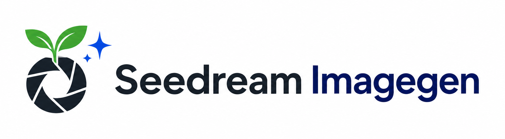

# Seedream Imagegen

<p align="center">
  
</p>

[](https://github.com/YFan945/Seedream-Imagegen/actions/workflows/ci.yml)
[](LICENSE.txt)
[](https://claude.com/claude-code)

<p align="center">
  <a href="README.md">English</a> · <strong>简体中文</strong>
</p>

面向 Claude Code 的 Doubao Seedream 5.0 Lite / Pro 生图 skill，通过火山方舟 Ark 生成和编辑位图。项目统一使用一套受校验的 Python CLI，覆盖模型校验、免费 dry-run、请求状态恢复、原子保存、Lite 组图和可选色键转透明。

## 功能

- `generate`：文生图、参考图生图、多图融合和 Lite 组图。
- `edit`：只修改明确目标并保持未要求内容不变。
- 结构化 prompt：明确任务分类、参考图角色、逐字文字和编辑不变项，并提供常用场景模板。
- 保守计费状态：408、429、5xx、未知 Ark 错误、超时、断连和保存不确定均保留为 `ambiguous`，不自动重试。
- 递归脱敏、聚合请求上限、精确输出预检和原子 no-clobber 保存。
- 已验证的色键 matte、foreground recovery、despill、border-connected、EXIF 转正和静态 HEIF 支持。

## 文档

- [Skill 工作流](SKILL.md)：模型选择、生成流程、计费保护和交付规则。
- [Prompt 规则](references/prompting.md)与[场景模板](references/sample-prompts.md)：由 agent 按需选择结构化 prompt，用户无需填写表单。
- [视觉示例](references/visual-examples.md)：可选风格参考，默认不会加入请求。
- [CLI 参考](references/cli.md)、[Lite 规范](references/lite.md)与[Pro 规范](references/pro.md)：命令、参数和模型边界。
- [色键参考](references/chroma-key.md)：受校验的透明背景工作流与限制。

## 先置条件

- 支持 skills 的 Claude Code 2.1.196+。
- Python 3.10+ 与 `pip`。
- 可访问所选 Seedream 模型的火山方舟 Ark API Key。
- 真实请求时可访问 Ark endpoint 的网络环境。
- 统一依赖文件：`requirements.txt` 同时包含运行与测试依赖。

## 安装

`npx skills` 默认安装到当前 project；`-g` 选择个人 global scope。本 skill 显式锁定 Claude Code。

个人安装，对所有项目可用：

```powershell
npx skills add YFan945/Seedream-Imagegen -g -a claude-code -y
Test-Path "$HOME\.claude\skills\imagegen\SKILL.md"
python -m pip install -r "$HOME\.claude\skills\imagegen\requirements.txt"
```

项目安装，在目标项目根目录执行：

```powershell
npx skills add YFan945/Seedream-Imagegen -a claude-code -y
Test-Path ".claude\skills\imagegen\SKILL.md"
python -m pip install -r ".claude\skills\imagegen\requirements.txt"
```

安装器输出与预期不同时，不要假定发现成功：个人安装最终必须存在 `~/.claude/skills/imagegen/SKILL.md`，项目安装必须存在 `.claude/skills/imagegen/SKILL.md`。路径依据见 [Claude Code skills 文档](https://code.claude.com/docs/en/slash-commands)，scope 与 `-a claude-code` 依据见 [`npx skills` 仓库](https://github.com/vercel-labs/skills)。

手工 Git 安装：

```powershell
git clone https://github.com/YFan945/Seedream-Imagegen.git "$HOME\.claude\skills\imagegen"
python -m pip install -r "$HOME\.claude\skills\imagegen\requirements.txt"
```

```bash
git clone https://github.com/YFan945/Seedream-Imagegen.git "$HOME/.claude/skills/imagegen"
python -m pip install -r "$HOME/.claude/skills/imagegen/requirements.txt"
```

使用 ZIP 时把解压目录重命名为 `imagegen`，并验证同一最终 `SKILL.md` 路径。卸载时只删除该 `imagegen` 目录；由 CLI 管理的个人安装也可运行 `npx skills remove imagegen -g -a claude-code`。

## 配置

在已安装 skill 中复制 `.env.example` 为 `.env`，填写 API Key。`ARK_BASE_URL` 为可选项，仅在使用自定义 Ark endpoint 时添加：

```dotenv
ARK_API_KEY=你的_ark_api_key
# ARK_BASE_URL=https://custom.example/api/v3
# ARK_PRO_MODEL=你的_pro_model_id
# ARK_LITE_MODEL=你的_lite_model_id
```

CLI 内置基础地址为 `https://ark.cn-beijing.volces.com/api/v3`，Pro 与 Lite 也各有内置默认 Model ID。`ARK_BASE_URL`、`ARK_PRO_MODEL`、`ARK_LITE_MODEL` 均为可选覆盖项。配置优先级为进程环境、skill-local `.env`、内置默认值。CLI 惰性读取这四个键到每次运行的不可变配置对象，不修改 `os.environ`、Windows 环境设置或 `.env`；支持有或无 BOM 的 UTF-8 文件。不得提交 `.env`，不得把凭据写入 prompt 或日志。

## 免费 smoke test

可从任意项目目录运行；只做本地预检，不需要 API Key：

```powershell
$skillDir = "$HOME\.claude\skills\imagegen"
$projectDir = (Get-Location).Path
python "$skillDir\scripts\image_gen.py" generate --model lite `
  --prompt "一只坐在窗边的橘猫，柔和晨光" `
  --out "$projectDir\output\cat.png" --dry-run
```

Claude Code 渲染 `SKILL.md` 时解析 skill 与项目根目录；后续参考文件使用得到的本地 `$skillDir` / `$projectDir`，不传递原始字符串替换。agent prompt 临时文件使用项目根目录 `.seedream-prompt-<random-id>.txt`；真实生成无论成功或失败都会清理该文件，dry-run 保留供真实请求复用。真实生图可能计费；遇到 `pending` 或 `ambiguous` 时先核对输出与计费，不得删除状态或自动重试。

`--dry-run` 只在显式传参时执行，不是普通生成的默认步骤。需要联网且未指定模型时直接使用 Lite；用户或 prompt 明确要求联网，以及带有具体近期日期的世界局势等时效任务，都启用 `--web-search`，该参数本身不强制要求 dry-run。联网与 Pro 能力同时被明确要求时，应先让用户二选一。

## 模型边界

| 能力 | Lite | Pro |
|---|---|---|
| 分辨率 | 2K / 3K / 4K | 1K / 2K |
| 参考图 | 最多 14 张 | 最多 10 张 |
| 组图 / stream / web search | 支持 | 不支持 |
| 视觉控制 | 普通箭头、框选和涂鸦提示 | 优先用于精准坐标/区域交互 |

当前公开 Ark 页面无法把每个 Model ID 和限制定位到可直接引用的静态正文。[`references/lite.md`](references/lite.md) 与 [`references/pro.md`](references/pro.md) 是版本化本地约束；修改前必须重新核对官方 Ark 文档。

## 色键边界

色键只适用于平坦、高饱和背景和不含键色色相族的实心主体，不是毛发、烟雾、玻璃、液体、薄纱、运动模糊、软阴影或半透明对象的通用分割工具。受校验命令、alpha 契约、失败规则和三项交付检查见 [`references/chroma-key.md`](references/chroma-key.md)。

## 开发测试

在克隆仓库根目录执行：

```powershell
python -m pip install -r requirements.txt
python -m pytest -q
python -m compileall -q scripts tests
python tests\benchmark_remove_chroma_key.py --max-seconds 7
git diff --check
```

`pyproject.toml` 用于标准化项目元数据和 `pytest` 配置（当前包含测试目录与默认报告）；它不是第二个依赖安装入口。所有依赖只通过 `requirements.txt` 安装。

测试全局阻断真实网络，不会发起计费 Ark 请求。协作规则见 [AGENTS.md](AGENTS.md)。

## 许可证

Apache License 2.0，见 [LICENSE.txt](LICENSE.txt)。
