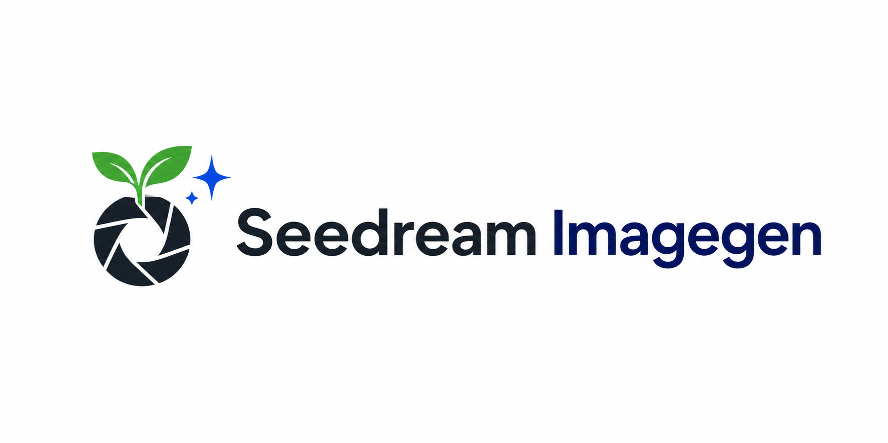

# Seedream Imagegen

<p align="center">
  
</p>

[](https://github.com/YFan945/Seedream-Imagegen/actions/workflows/ci.yml)
[](LICENSE.txt)
[](https://claude.com/claude-code)

A Claude Code skill for generating and editing raster images with Doubao Seedream 5.0 Lite or Pro through Volcengine Ark. It uses one validated Python CLI for model checks, free dry-runs, request-state recovery, atomic saves, Lite image sets, and optional chroma-key conversion.

Brand assets: the wide README banner is [`assets/seedream-imagegen-logo.png`](assets/seedream-imagegen-logo.png); the text-free square skill icon is [`assets/seedream-imagegen-icon.png`](assets/seedream-imagegen-icon.png). They are repository presentation assets, not generation inputs or outputs.

> 中文文档：[README-zh.md](README-zh.md)

## Features

- `generate` for text-to-image, reference-image generation, multi-image fusion, and Lite image sets.
- `edit` for explicit edits that preserve unrequested content.
- Conservative billing state: 408, 429, 5xx, unknown Ark errors, timeouts, disconnects, and uncertain saves remain `ambiguous` and are never retried automatically.
- Recursive secret redaction, aggregate request limits, exact output preflight, and atomic no-clobber saves.
- Validated chroma-key matte, foreground recovery, despill, border-connected mode, EXIF transpose, and static HEIF support.

## Requirements

- Claude Code with skills support.
- Python 3.10+ and `pip`.
- A Volcengine Ark API key with access to the selected Seedream model.
- Network access to the configured Ark endpoint for real requests.

## Install

`npx skills` installs to the current project by default; `-g` selects the personal/global scope. This skill targets Claude Code explicitly.

Personal install, available in every project:

```powershell
npx skills add YFan945/Seedream-Imagegen -g -a claude-code -y
Test-Path "$HOME\.claude\skills\imagegen\SKILL.md"
python -m pip install -r "$HOME\.claude\skills\imagegen\requirements.txt"
```

Project install, run from the target project root:

```powershell
npx skills add YFan945/Seedream-Imagegen -a claude-code -y
Test-Path ".claude\skills\imagegen\SKILL.md"
python -m pip install -r ".claude\skills\imagegen\requirements.txt"
```

If installer output differs, do not assume discovery succeeded: the final required entrypoint is exactly `~/.claude/skills/imagegen/SKILL.md` for a personal install or `.claude/skills/imagegen/SKILL.md` for a project install. Claude Code documents those locations in its [skills guide](https://code.claude.com/docs/en/slash-commands); `npx skills` documents scope and `-a claude-code` in its [CLI repository](https://github.com/vercel-labs/skills).

Manual Git install:

```powershell
git clone https://github.com/YFan945/Seedream-Imagegen.git "$HOME\.claude\skills\imagegen"
python -m pip install -r "$HOME\.claude\skills\imagegen\requirements.txt"
```

```bash
git clone https://github.com/YFan945/Seedream-Imagegen.git "$HOME/.claude/skills/imagegen"
python -m pip install -r "$HOME/.claude/skills/imagegen/requirements.txt"
```

For ZIP installation, rename the extracted directory to `imagegen` and verify the same final `SKILL.md` path. To uninstall, remove only that installed `imagegen` directory or run `npx skills remove imagegen -g -a claude-code` for a personal CLI-managed install.

## Configuration

Copy `.env.example` to `.env` inside the installed skill and set the API key. `ARK_BASE_URL` is optional and should only be added for a custom Ark endpoint:

```dotenv
ARK_API_KEY=your_ark_api_key
# ARK_BASE_URL=https://custom.example/api/v3
# ARK_PRO_MODEL=your_pro_model_id
# ARK_LITE_MODEL=your_lite_model_id
```

The built-in base URL is `https://ark.cn-beijing.volces.com/api/v3`; Pro and Lite also have built-in default Model IDs. `ARK_BASE_URL`, `ARK_PRO_MODEL`, and `ARK_LITE_MODEL` are optional overrides. Configuration precedence is process environment, then skill-local `.env`, then built-in defaults. The CLI lazily reads only these four keys into an immutable per-run config; it does not modify `os.environ`, Windows environment settings, or `.env`. UTF-8 files with or without BOM are accepted. Never commit `.env` or paste credentials into prompts and logs.

## Free smoke test

Run from any project directory. This is local-only and does not require an API key:

```powershell
$skillDir = "$HOME\.claude\skills\imagegen"
$projectDir = (Get-Location).Path
python "$skillDir\scripts\image_gen.py" generate --model lite `
  --prompt "一只坐在窗边的橘猫，柔和晨光" `
  --out "$projectDir\output\cat.png" --dry-run
```

Claude should use `${CLAUDE_SKILL_DIR}` for bundled scripts. Agent prompt files now use `.seedream-prompt-<random-id>.txt` directly in the project root, without creating `tmp/seedream`; real generation cleans the file on either success or failure, while dry-run retains it for the real request. Real generation may incur charges. Never delete state or retry a `pending` or `ambiguous` request without checking output and billing first.

`--dry-run` runs only when explicitly supplied; it is not the default for ordinary generation. When web access is needed and no model was selected, use Lite directly. Enable `--web-search` when the user or prompt explicitly requests it or when a recent dated world-situation task depends on current facts; that flag alone does not require dry-run. If web access and Pro capabilities are both explicitly requested, ask the user to choose one.

## Model boundaries

| Capability | Lite | Pro |
|---|---|---|
| Resolution | 2K / 3K / 4K | 1K / 2K |
| Reference images | Up to 14 | Up to 10 |
| Image sets / stream / web search | Supported | Not supported |
| Visual controls | Ordinary arrows, boxes, and doodle cues | Precise coordinate/region interaction preferred |

The public Ark pages do not currently expose every Model ID and limit as directly addressable static text. Treat [`references/lite.md`](references/lite.md) and [`references/pro.md`](references/pro.md) as versioned local constraints and re-check official Ark documentation before changing them.

## Chroma-key scope

Chroma key is for flat, high-saturation backgrounds and solid subjects that do not contain the key hue family. It is not a general segmentation tool for hair, smoke, glass, liquids, veils, motion blur, soft shadows, or translucency. See [`references/chroma-key.md`](references/chroma-key.md) for the validated command, alpha contract, failure rules, and three-step delivery check.

## Development

From the cloned repository root:

```powershell
python -m pip install -r requirements-dev.txt
python -m pytest -q
python -m compileall -q scripts tests
python tests\benchmark_remove_chroma_key.py --max-seconds 7
git diff --check
```

Tests globally block real network access and never issue a billable Ark request. See [AGENTS.md](AGENTS.md) for contribution rules.

## License

Apache License 2.0. See [LICENSE.txt](LICENSE.txt).
